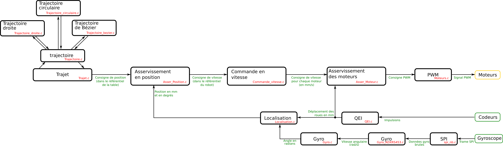

Code de déplacement du robot holonome 2023
==========================================
Ce dépôt contient de code de déplacement du robot holonome de l'équipe [Poivron Robotique](http://poivron-robotique.fr). Ce robot a pour ambition de participer à la coupe de France de Robotique en 2023.

Le but est de présenter un code assurant toutes les fonctions de déplacement du robot, allant de la commande PWM des moteurs jusqu'au suivi d'une trajectoire (droite, portion de cercle, courbe de Bézier) en passant par le contrôle de l'accélération et de décélération.

Ce code est conçu pour s'exécuter sur un Raspberry Pi Pico.

Voici un bref paragraphe explicatif pour chaque bloc fonctionnel.

Moteurs
-------
Initialise les modules PWM et propose les fonctions pour les piloter.

QEI
---
Décode les signaux renvoyés par les codeurs et les convertit en distance parcoure par les roues en millimètres.

L'interprétation des signaux se fait grâce aux PIOs et à l'[exemple fourni dans le SDK](https://github.com/raspberrypi/pico-examples/tree/master/pio/quadrature_encoder).

SPI
---
Tentative de créer des fonctions non bloquantes pour le SPI. Mais vu la vitesse du SPI, l'intérêt est limité. Une partie du code n'a pas été éprouvé.

Gyro ADXRS453
----
Initialise le Gyroscope ADXRS453. Décode les données fournies par le gyroscope et les converti en radian/seconde. Les biais éventuels ne sont pas compensés.

Gyro
----
Compensation du biais du gyroscope et intégration de la vitesse pour obtenir l'orientation.

Localisation
------------

Utilisation des équations définies dans [l'étude](http://poivron-robotique.fr/Robot-holonome-localisation-partie-2.html) pour obtenir la position du robot à partir du déplacement mesuré de ses roues.

Devrait à terme aussi utiliser les valeurs du gyroscope pour gagner en précision.

Asservissement des moteurs
--------------------------
À partir d'une consigne de vitesse pour chaque moteur, utilisation d'un correcteur proportionnel et intégrale (PI) pour déterminer la commande des moteurs.

Commande de vitesse
-------------------
À partir de la rotation désirée et des vitesses X et Y dans le référentiel du robot, détermine la consigne de vitesse pour chaque moteur grâce aux [lois de commande](http://poivron-robotique.fr/Robot-holonome-lois-de-commande.html).

Asservissement en position
--------------------------
À partir d'une consigne de position, détermine la rotation désirée et les vitesses X et Y dans le référentiel du robot. Ceci en deux étapes :
1. Asservissement avec un simple gain proportionnel
2. Projection des vitesses X et Y dans le référentiel du robot.

Gestion des trajets
-------------------
Cette fonction permet de parcourir une trajectoire en tenant compte des contraintes de vitesse.
1. Calcul de la vitesse
   - Prise en compte de l'accélération maximale
   - Prise en compte de la décélération pour s'arrêter. Voir [cet article](http://poivron-robotique.fr/Consigne-de-vitesse.html).
2. Calcul de l'avancement sur la trajectoire. 
3. Obtention de la nouvelle consigne de position.

Pour se déplacer sur une trajectoire, cette fonction utilise les outils de gestion des trajectoires définis dans les fichiers `trajectoire*`.